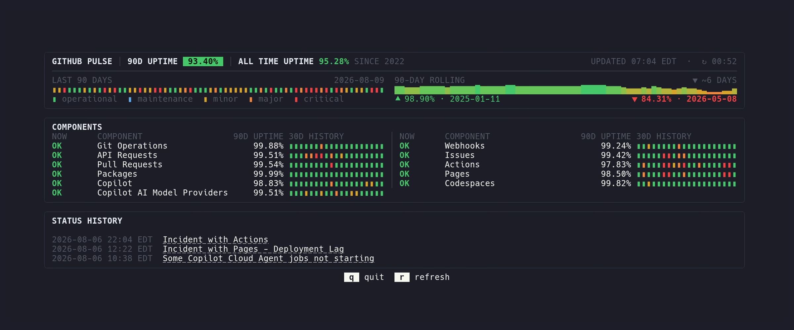

# GitHub Pulse



GitHub Pulse is a fast, terminal-native view of GitHub service health. It pairs
the official live status with transparent reconstructed uptime history, then
keeps the two sources honest by never pretending they are the same dataset.

It runs as `gh pulse`, works without a GitHub token, and can emit stable JSON for
scripts and agents.

## What You Get

- Current GitHub platform and component health from GitHub Status.
- A compact 90-day daily-state strip and per-component 30-day history.
- Reconstructed 90-day uptime, equivalent downtime, and rolling history.
- Recent official status updates with clickable incident links.
- Responsive color, monochrome, narrow-terminal, and scrollable layouts.
- One-shot JSON with deterministic ordering and no terminal formatting.

## Install

Install a published release as a GitHub CLI extension:

```sh
gh extension install cpcloud/gh-pulse
gh pulse
```

The repository is currently private, so installation requires a GitHub CLI
login that can read it. Running the extension does not use that login and sends
no credentials to any status endpoint.

The published container supports 64-bit x86 and ARM Linux and runs as a
non-root user:

```sh
docker run --rm -it ghcr.io/cpcloud/gh-pulse:latest
```

With Nix, build or run the default package from a local checkout:

```sh
nix build .#default
nix run .#default
```

## Controls

| Key | Action |
| --- | --- |
| `r` | Refresh all sources in place |
| `q`, `Esc` | Quit |
| Arrow keys, `j`, `k` | Scroll when the dashboard does not fit |

The dashboard refreshes current status automatically. Reconstructed history is
loaded at startup and refreshed only when you press `r`.

## JSON For Scripts And Agents

`--json` fetches each source once, writes one JSON document, and exits:

```sh
gh pulse --json
```

The top-level `schema_version` starts at `1`. The document includes the current
overall state, ordered components, active incidents and maintenance, recent
feed entries, reconstructed history, source timestamps, and source-specific
errors.

Examples:

```sh
gh pulse --json | jq -r '.overall.state'
gh pulse --json | jq '.history.uptime_90_days'
gh pulse --json | jq '.components[] | {name, state}'
```

Timestamps are RFC 3339 UTC in JSON. The interactive dashboard renders them in
the computer's local time zone.

## Where The Data Comes From

GitHub Pulse deliberately uses separate sources for separate jobs:

- [GitHub Status](https://githubstatus.com) supplies official current status,
  component state, active incidents, maintenance, and the recent Atom feed.
- [The Missing GitHub Status Page](https://mrshu.github.io/github-statuses/)
  explains and publishes the reconstructed incident history used for uptime.
- [mrshu/github-statuses](https://github.com/mrshu/github-statuses) is the
  history dataset consumed at runtime.

The official API and Atom feed drive the current and recent-status views. The
reconstructed dataset alone drives historical uptime. GitHub Pulse does not
compare, reconcile, or fill gaps between them.

The component uptime column is the mrshu reconstruction, not GitHub Status's
published 90-day component chart, so the percentages need not match.

### Uptime Calculation

History coverage begins at the source project's declared start on 2022-06-11.
Every positive, non-maintenance incident interval counts as downtime. Scheduled
maintenance does not. Overlapping downtime intervals are merged before their
duration is summed.

The headline percentage uses the latest 90 complete UTC days. Daily state bars
show the worst incident severity touching each UTC day; maintenance is shown as
its own state but excluded from the uptime denominator. Rolling points use a
fixed 90-day window. Percentages are selected from full-precision durations and
rounded only for output.

Component uptime is calculated only when the history dataset explicitly tags
that component. Missing component history stays missing; it never becomes a
fabricated 100 percent.

## Network And Failure Behavior

The extension makes bounded HTTPS requests with an explicit User-Agent, an
eight-second timeout, cancellation, response-size limits, HTTP status checks,
and typed decoding. It sends no authorization header, cookie, or GitHub CLI
credential. Errors identify the failing source without logging response bodies.

The three sources fail independently. A history or feed outage does not hide
official current status, and unavailable history does not become a green chart.
In JSON mode, failure of the official current-status source returns a non-zero
exit code.

## Develop

The Nix flake is the supported development environment:

```sh
nix develop
goreleaser check
go test ./...
golangci-lint run ./...
prek install
prek run --all-files
```

Build the same package CI builds:

```sh
nix build .#default
./result/bin/gh-pulse --version
```

The default package and `packages.<system>.gh-pulse` support x86-64 and ARM64
Linux plus ARM64 macOS. Native Go CI builds and tests x86-64 and ARM64 on Linux,
macOS, and Windows.

GoReleaser builds the six GitHub CLI binaries, their SHA-256 checksums, and the
multi-architecture container image. Test the complete release configuration
without publishing anything with:

```sh
goreleaser release --snapshot --clean
```

GHCR creates the package as private on its first publish. After the first tagged
release, the package owner must open `cpcloud` > Packages > `gh-pulse` > Package
settings, choose Change visibility, and select Public. GoReleaser cannot change
that account-level setting, and the workflow deliberately has no package-admin
permission. This is a one-time setting; GitHub does not allow a public package
to be made private again.
